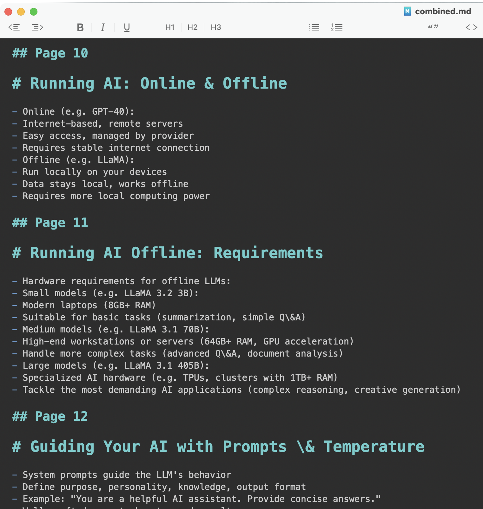

# PDF Analyzer with Mistral OCR

This project uses Mistral's OCR capabilities to analyze PDF documents and convert them to structured markdown. It demonstrates how to use the Mistral API to extract text, structure, and images from PDFs and save the results in a readable format.




## How It Works

This script demonstrates the complete workflow for processing local PDF files with Mistral's OCR API:

1. **Upload**: The local PDF file is uploaded to Mistral's servers
2. **Retrieve**: The uploaded file is retrieved to confirm successful upload
3. **Get Signed URL**: A signed URL is generated for the uploaded file
4. **OCR Processing**: The PDF is processed using the signed URL
5. **Extract Content**: Text content is extracted and saved as markdown files
6. **Extract Images**: Images are extracted from the OCR response and properly formatted
7. **Save Results**: Both text and images are saved in the output directory

## Setup

1. Create and activate a virtual environment:
   ```bash
   python -m venv venv
   source venv/bin/activate  # On Windows: venv\Scripts\activate
   ```

2. Install the required dependencies:
   ```bash
   pip install mistralai python-dotenv
   ```

3. Configure your API key:
   - Edit the `.env` file and replace `your_api_key_here` with your actual Mistral API key

## Usage

1. Run the script:
   ```bash
   python pdf_analyzer.py
   ```

2. The output will be saved in the `output` directory:
   - `combined.md`: All pages combined in a single markdown file
   - `page_X.md`: Individual markdown files for each page
   - `ocr_response.json`: The full OCR response in JSON format

## Customization

1. To analyze a different PDF file:
   - Modify the `pdf_path` variable in the `main()` function of `pdf_analyzer.py`

2. To change the output directory:
   - Modify the `output_dir` variable in the `main()` function

## Project Structure

- `pdf_analyzer.py`: Main script for processing PDFs and generating markdown
- `.env`: Contains your Mistral API key
- `output/`: Directory where the generated markdown files are saved
- `.gitignore`: Excludes sensitive and generated files from version control
