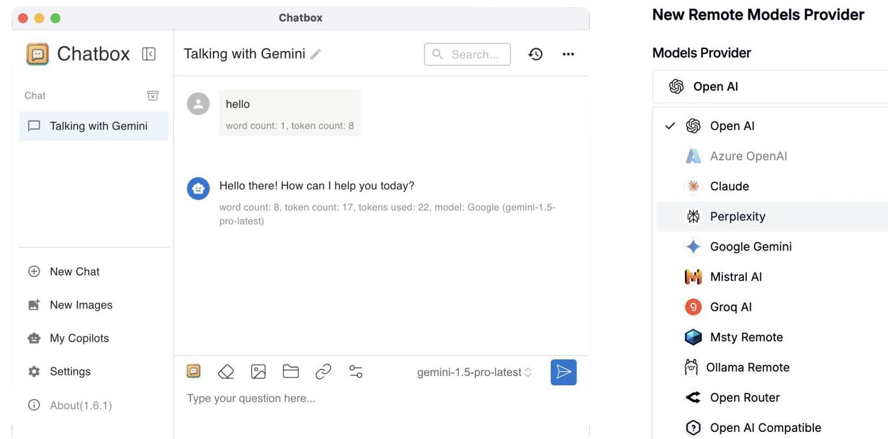

## Page 0

## Page 1

- Diverse Team across Singapore, Hong Kong, and Australia.
- Using AI to address global challenges through collaboration across startups, corporations, academia, and government.
- Make an impact while growing your skills and network.
$\rightarrow$ Get involved: attend events, join projects, be part of the change!

## Page 2

# December 10: Al Masterclass 

## Practical Al-Driven Workflows

- Discover practical workflows that incorporate Al tools and applications.
- Gain insights into how Al can streamline processes and enhance productivity.

## Hands-On Experience with Use Cases Across Industries

- Engage in hands-on activities that showcase real-world Al applications.
- Explore use cases that span various industries and job functions, including marketing, finance, operations, and more.

Keith B Carter

Uli Hitzel

## Page 3

# AI For Humanity Forum 2024 

- 12 December 2024 | 9:00am - 5:00pm
- Catapult by Capitaland, 1 Rochester Park, \#02-01 Rochester Commons, Singapore 139212

Register Now

Use the code AI4HELECMINDS for $35 \%$ OFF!

## Page 4

# 2 Years of ChatGPT 

- ChatGPT (2022) sparks conversational AI revolution
- 2024: Diverse landscape of chat services and models
- Claude.ai, Le Chat
- Open models, smaller models (e.g., LLaMA)
- Private/Offline, locally-run models gain popularity
- Al landscape offers a spectrum of choices
- Free vs. paid
- Online vs. offline
- Varying model sizes and capabilities

- Open vs. proprietary options

## Page 5

# The LLM Zoo 

- Open vs. Proprietary
- Different LLMs have varying capabilities and complexity levels
- Model size (parameters) generally correlates with performance
- More advanced tasks require larger, more capable models

## OpenAI

## (1) Meta

Gemini

## Page 6

# Which One For What? 

## Page 7

# Running AI: Online & Offline 

- Online (e.g. GPT-4o):
- Internet-based, remote servers
- Easy access, managed by provider
- Requires stable internet connection
- Offline (e.g. LLaMA):
- Run locally on your devices
- Data stays local, works offline
- Requires more local computing power

## Page 8

# Use Free GUI Tools + Free Online AI Services 

## Page 9

# Running Models Locally 

## Local AI Models

## Page 10

# Running AI: Online & Offline 

- Online (e.g. GPT-40):
- Internet-based, remote servers
- Easy access, managed by provider
- Requires stable internet connection
- Offline (e.g. LLaMA):
- Run locally on your devices
- Data stays local, works offline
- Requires more local computing power

## Page 11

# Running AI Offline: Requirements 

- Hardware requirements for offline LLMs:
- Small models (e.g. LLaMA 3.2 3B):
- Modern laptops (8GB+ RAM)
- Suitable for basic tasks (summarization, simple Q\&A)
- Medium models (e.g. LLaMA 3.1 70B):
- High-end workstations or servers (64GB+ RAM, GPU acceleration)
- Handle more complex tasks (advanced Q\&A, document analysis)
- Large models (e.g. LLaMA 3.1 405B):
- Specialized AI hardware (e.g. TPUs, clusters with 1TB+ RAM)
- Tackle the most demanding AI applications (complex reasoning, creative generation)

## Page 12

# Guiding Your AI with Prompts \& Temperature 

- System prompts guide the LLM's behavior
- Define purpose, personality, knowledge, output format
- Example: "You are a helpful AI assistant. Provide concise answers."
- Well-crafted prompts key to good results
- Temperature: Randomness of LLM's outputs
- Low temp: Focused, deterministic, less creative
- High temp: More random, creative, less focused
- Adjust temperature based on task (e.g. low for factual Q\&A, high for story generation)

## Page 13

# naida AI Chat Playground 

- Fully runs in the browser
- Use free Gemini AI from Google
- Get an API Key (access token) from Google
- Set system prompt, temperature
- Start chatting!

